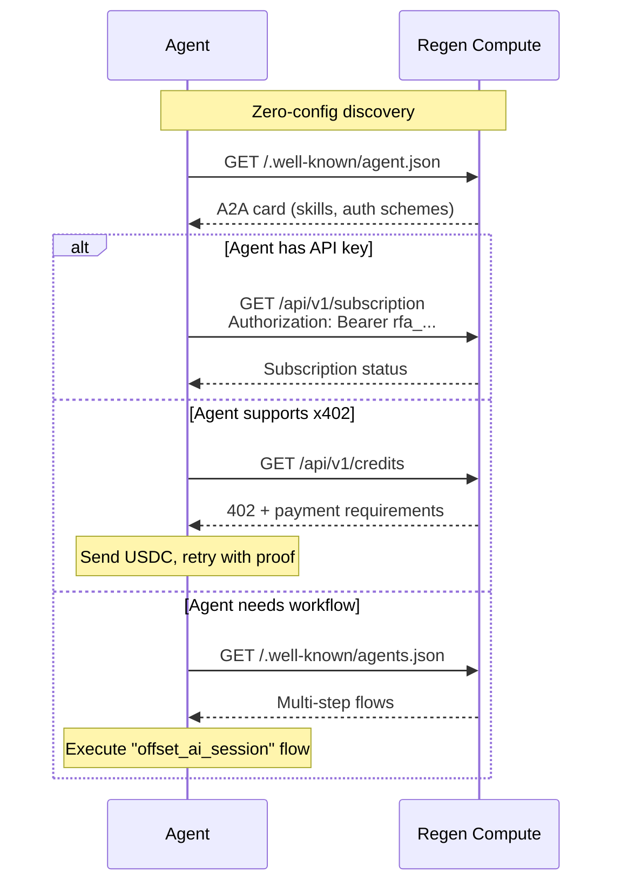

# Agent Discovery Endpoints

Regen Compute exposes three machine-readable discovery endpoints that allow autonomous AI agents, orchestration platforms, and crawlers to discover capabilities without human intervention.

All three are served by the web server (`npx regen-compute serve`) and require no authentication.

## Overview

| Endpoint | Protocol | Purpose |
|----------|----------|---------|
| `/.well-known/mcp/server-card.json` | MCP | Describes the MCP server — tools, transport, install command |
| `/.well-known/agent.json` | Google A2A | Describes agent skills, auth schemes, input/output modes |
| `/.well-known/agents.json` | Custom | Describes multi-step API workflows for orchestration agents |

## MCP Server Card

**URL**: `/.well-known/mcp/server-card.json`

Describes this MCP server for tools that scan for available MCP servers. Follows the emerging MCP server card convention.

### Payload

```json
{
  "name": "regen-compute",
  "version": "0.3.4",
  "description": "Ecological accountability for AI compute — retire verified ecocredits on Regen Network",
  "transport": ["stdio"],
  "install": "npx regen-compute",
  "homepage": "https://compute.regen.network",
  "repository": "https://github.com/regen-network/regen-compute",
  "npm": "https://www.npmjs.com/package/regen-compute",
  "capabilities": {
    "tools": true,
    "prompts": true,
    "resources": false
  },
  "tools": [
    "estimate_session_footprint",
    "estimate_monthly_footprint",
    "browse_available_credits",
    "retire_credits",
    "get_retirement_certificate",
    "get_impact_summary",
    "check_subscription_status"
  ],
  "credit_types": [
    "carbon",
    "biodiversity",
    "umbrella_species",
    "marine_biodiversity",
    "regenerative_grazing"
  ]
}
```

### How agents use it

1. Agent discovers the server card at a well-known URL
2. Reads `transport: ["stdio"]` to know this is a local MCP server
3. Reads `install: "npx regen-compute"` to auto-install
4. Reads `tools` array to understand what capabilities are available
5. Reads `capabilities` to know whether prompts/resources are supported

## Google A2A Agent Card

**URL**: `/.well-known/agent.json`

Follows the [Google Agent-to-Agent (A2A) protocol](https://google.github.io/A2A/) specification. Describes what this agent can do and how to authenticate.

### Payload

```json
{
  "name": "Regen Compute",
  "description": "Retire verified ecological credits on behalf of AI compute usage on Regen Network",
  "url": "https://compute.regen.network",
  "version": "1.0",
  "provider": {
    "organization": "Regen Network Development",
    "url": "https://regen.network"
  },
  "capabilities": {
    "streaming": false,
    "pushNotifications": false
  },
  "skills": [
    {
      "id": "estimate_footprint",
      "name": "Estimate AI Footprint",
      "description": "Estimate the ecological footprint of an AI session based on duration and tool calls"
    },
    {
      "id": "browse_credits",
      "name": "Browse Ecological Credits",
      "description": "View available carbon, biodiversity, and species stewardship credits with live pricing"
    },
    {
      "id": "retire_credits",
      "name": "Retire Ecological Credits",
      "description": "Permanently retire verified ecological credits on Regen Ledger"
    },
    {
      "id": "get_certificate",
      "name": "Get Retirement Certificate",
      "description": "Retrieve on-chain proof of credit retirement with verifiable transaction hash"
    },
    {
      "id": "check_subscription",
      "name": "Check Subscription Status",
      "description": "Check subscriber status, cumulative impact, and referral link"
    }
  ],
  "authentication": {
    "schemes": ["bearer", "x402"],
    "credentials_url": "https://compute.regen.network",
    "description": "API key via subscription, or x402 per-request payment (USDC on Base). x402-enabled agents can pay automatically."
  },
  "defaultInputModes": ["application/json"],
  "defaultOutputModes": ["application/json"]
}
```

### How agents use it

1. Orchestration agent fetches `/.well-known/agent.json` from any URL
2. Reads `skills` to decide if this agent is useful for the current task
3. Reads `authentication.schemes` — `bearer` for API key, `x402` for automatic payment
4. For `x402`, the agent can pay per-request without pre-provisioning (see [x402-agent-flow.md](x402-agent-flow.md))
5. Uses the REST API (`/api/v1/`) to invoke skills programmatically

## Multi-Step Agent Flows

**URL**: `/.well-known/agents.json`

Custom endpoint that describes complete API workflows. Designed for orchestration agents that need to chain multiple API calls to accomplish a goal.

### Payload

```json
{
  "version": "1.0",
  "name": "Regen Compute",
  "description": "Ecological accountability for AI compute via verified credit retirement on Regen Network",
  "api_base": "https://compute.regen.network/api/v1",
  "openapi": "https://compute.regen.network/api/v1/openapi.json",
  "authentication": {
    "type": "bearer",
    "header": "Authorization"
  },
  "flows": [
    {
      "id": "offset_ai_session",
      "name": "Offset AI Session",
      "description": "Estimate footprint, browse credits, retire, get certificate",
      "steps": [
        {
          "method": "GET",
          "path": "/footprint?session_minutes={minutes}&tool_calls={calls}",
          "description": "Estimate session footprint"
        },
        {
          "method": "GET",
          "path": "/credits?type=all",
          "description": "Browse available credits"
        },
        {
          "method": "POST",
          "path": "/retire",
          "body": { "credit_class": "string", "quantity": "number" },
          "description": "Retire ecological credits"
        },
        {
          "method": "GET",
          "path": "/certificates/{nodeId}",
          "description": "Get retirement certificate"
        }
      ]
    },
    {
      "id": "check_impact",
      "name": "Check Ecological Impact",
      "description": "View subscription status and network-wide impact",
      "steps": [
        {
          "method": "GET",
          "path": "/subscription",
          "description": "Check subscription and cumulative impact"
        },
        {
          "method": "GET",
          "path": "/impact",
          "description": "View Regen Network aggregate stats"
        }
      ]
    }
  ]
}
```

### How agents use it

1. Orchestration agent fetches `/.well-known/agents.json`
2. Reads `flows` to find a matching workflow (e.g., "offset_ai_session")
3. Executes `steps` sequentially, substituting parameters from previous step results
4. Uses `api_base` to construct full URLs and `openapi` to validate request/response schemas
5. Authentication via `Authorization: Bearer <api_key>` header on all requests

## Discovery Flow



## Source

- Server card: [`src/server/index.ts`](../src/server/index.ts) (line 166)
- A2A card: [`src/server/index.ts`](../src/server/index.ts) (line 197)
- Flows: [`src/server/index.ts`](../src/server/index.ts) (line 231)
- x402 payment protocol: [`docs/x402-agent-flow.md`](x402-agent-flow.md)
- OpenAPI spec: [`src/server/openapi.json`](../src/server/openapi.json)
