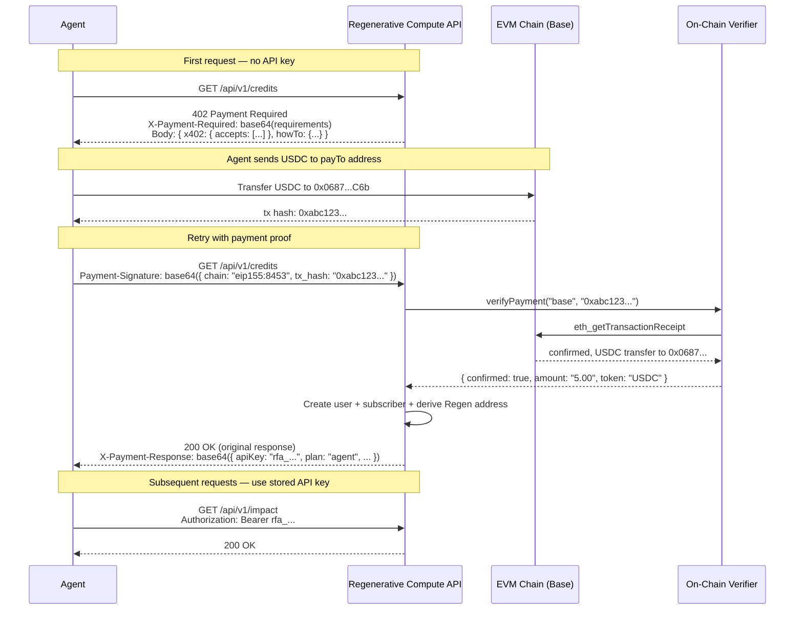

# x402 Autonomous Agent Payment Flow

Regenerative Compute implements a self-settling [x402 payment protocol](https://www.x402.org/) for its Developer API. This allows autonomous AI agents to pay for API access with USDC on EVM chains — no API key, no signup, no human in the loop.

## Overview

The x402 middleware intercepts unauthenticated requests to protected `/api/v1/` endpoints. Agents that already have an API key pass through normally. Agents without one receive a `402 Payment Required` response containing payment instructions. After sending a USDC payment on-chain and retrying with the transaction proof, the agent is automatically provisioned with an API key and subscription.

## Endpoint Classification

### Free (no auth required)

| Endpoint | Method | Description |
|----------|--------|-------------|
| `/api/v1/openapi.json` | GET | OpenAPI specification |
| `/api/v1/payment-info` | GET | Payment addresses and pricing |
| `/api/v1/confirm-payment` | POST | Confirm a crypto payment |

### Protected (API key or x402 payment required)

| Endpoint | Method | Description |
|----------|--------|-------------|
| `/api/v1/retire` | POST | Retire ecological credits |
| `/api/v1/credits` | GET | Browse available credits |
| `/api/v1/footprint` | GET | Estimate session footprint |
| `/api/v1/certificates/:id` | GET | Get retirement certificate |
| `/api/v1/impact` | GET | Network impact statistics |
| `/api/v1/subscription` | GET | Subscription status |

## Sequence Diagram



## The 402 Response

When an unauthenticated request hits a protected endpoint, the server returns:

**Status**: `402 Payment Required`

**Headers**:
- `X-Payment-Required`: Base64-encoded JSON payment requirements (x402 standard)

**Body** (JSON):

```json
{
  "status": 402,
  "error": "PAYMENT_REQUIRED",
  "message": "Payment required. Send a crypto payment and include the proof in the Payment-Signature header, or use a valid API key.",
  "x402": {
    "x402Version": 1,
    "accepts": [
      {
        "scheme": "exact",
        "network": "eip155:8453",
        "maxAmountRequired": "0.01",
        "resource": "https://compute.regen.network/api/v1/*",
        "payTo": "0x0687cC26060FE12Fd4A6210c2f30Cf24a9853C6b",
        "asset": "erc20:0x833589fCD6eDb6E08f4c7C32D4f71b54bdA02913",
        "extra": { "name": "USDC", "version": "1.0" }
      }
    ]
  },
  "howTo": {
    "option1": {
      "description": "Pay with crypto via confirm-payment endpoint",
      "endpoint": "POST /api/v1/confirm-payment",
      "body": "{ \"chain\": \"base\", \"tx_hash\": \"0x...\", \"email\": \"you@example.com\" }"
    },
    "option2": {
      "description": "Pay inline via x402 Payment-Signature header",
      "header": "Payment-Signature: base64({ chain: 'eip155:8453', tx_hash: '0x...' })"
    },
    "payTo": "0x0687cC26060FE12Fd4A6210c2f30Cf24a9853C6b",
    "minimumPayment": "$1.25 (provisions a subscription)"
  }
}
```

## Payment-Signature Header

After sending USDC on-chain, the agent retries the request with a `Payment-Signature` header. The header value is base64-encoded JSON (raw JSON is also accepted as a fallback).

### Header format

```
Payment-Signature: base64(JSON payload)
```

### Payload fields

| Field | Required | Description |
|-------|----------|-------------|
| `chain` or `network` | Yes | CAIP-2 identifier (`eip155:8453`) or chain name (`base`) |
| `tx_hash`, `txHash`, or `transaction` | Yes | The on-chain transaction hash |
| `email` | No | Email for account binding |
| `from` or `payer` | No | Payer address (derived from tx if omitted) |

### Example

```bash
# Encode the payment proof
PROOF=$(echo -n '{"chain":"eip155:8453","tx_hash":"0xabc123..."}' | base64)

# Retry the request
curl -H "Payment-Signature: $PROOF" \
     https://compute.regen.network/api/v1/credits
```

### Supported chains

| CAIP-2 | Chain | USDC Contract |
|--------|-------|---------------|
| `eip155:8453` | Base | `0x833589fCD6eDb6E08f4c7C32D4f71b54bdA02913` |
| `eip155:1` | Ethereum | `0xA0b86991c6218b36c1d19D4a2e9Eb0cE3606eB48` |
| `eip155:137` | Polygon | `0x3c499c542cEF5E3811e1192ce70d8cC03d5c3359` |

Additional EVM chains (Arbitrum, Optimism, Avalanche, BNB, Linea, zkSync, Scroll, Mantle, Blast, Celo, Gnosis, Fantom, Mode) are accepted via the `confirm-payment` endpoint. Native tokens and any ERC-20 with CoinGecko pricing are also accepted there.

## How Provisioning Works

When the middleware verifies a valid payment:

1. **On-chain verification** — Calls `verifyPayment(chain, txHash)` which fetches the transaction receipt, checks confirmations, and identifies the token and amount via ERC-20 Transfer event logs.

2. **USD conversion** — Converts the payment amount to USD cents via CoinGecko prices. Stablecoins (USDC, USDT) convert at $1.00.

3. **Minimum check** — Payment must be at least **$1.25** (the Dabbler monthly rate). Payments below this threshold are rejected with `PAYMENT_TOO_SMALL`.

4. **User creation** — Finds an existing user by sender address or email, or creates a new one with a generated API key (`rfa_...`).

5. **Subscription provisioning** — Creates a subscription with duration based on the payment amount at the Agent rate ($5/month):
   - $1.25 → 1 month (Dabbler)
   - $25.00 → 5 months (Builder)
   - $50.00 → 10 months (Agent)
   - $250+ → Lifetime (never expires)

6. **Regen address derivation** — Derives a deterministic `regen1...` address for the subscriber using HD path `m/44'/118'/0'/0/{subscriberId}`. Credits retired on the subscriber's behalf are sent to this address.

7. **Burn budget** — 5% of the payment is allocated to the REGEN buy-and-burn fund.

## The X-Payment-Response Header

After successful verification and provisioning, the original request proceeds normally. The response includes an `X-Payment-Response` header with base64-encoded JSON:

```json
{
  "success": true,
  "txHash": "0xabc123...",
  "chain": "base",
  "network": "eip155:8453",
  "payer": "0x1234...",
  "amount": "5.00",
  "token": "USDC",
  "usdValue": "5.00",
  "apiKey": "rfa_abc123...",
  "plan": "agent",
  "expiresAt": "2026-04-25"
}
```

The agent should extract and store the `apiKey` from this header. All subsequent requests can use `Authorization: Bearer rfa_abc123...` — no further payments needed until the subscription expires.

## Idempotency

The same transaction hash can be submitted multiple times. If the payment has already been provisioned, the middleware returns the existing API key without creating duplicate accounts or subscriptions. This makes retries safe.

## Two Payment Options

Agents have two ways to pay:

### Option A: Inline x402 (single round-trip after payment)

1. Receive 402
2. Send USDC on-chain
3. Retry request with `Payment-Signature` header
4. Extract API key from `X-Payment-Response` header

This is the x402 standard flow. Best for agents that can send on-chain transactions.

### Option B: confirm-payment endpoint (separate provisioning step)

1. Send USDC on-chain
2. `POST /api/v1/confirm-payment` with `{ chain, tx_hash, email }`
3. Receive API key in the response body
4. Use `Authorization: Bearer <key>` for all subsequent requests

This is better for agents that prefer to separate payment from API usage, or that want an email record.

## Enabling x402

The x402 middleware is opt-in. Set `X402_ENABLED=true` in the server environment to activate it. When disabled, unauthenticated API requests receive a standard `401 Unauthorized` response instead of `402`.

## Source

- Middleware: [`src/server/x402-middleware.ts`](../src/server/x402-middleware.ts)
- Payment verification: [`src/services/crypto-verify.ts`](../src/services/crypto-verify.ts)
- Price conversion: [`src/services/crypto-price.ts`](../src/services/crypto-price.ts)
- Agent card: [`src/server/index.ts`](../src/server/index.ts) (`/.well-known/agent.json`)
